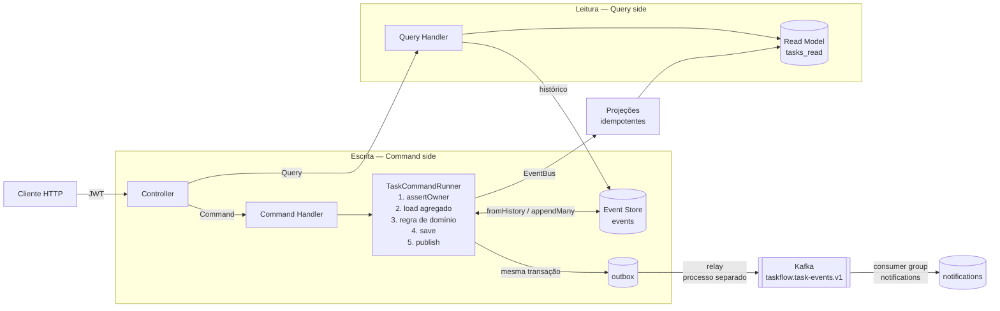
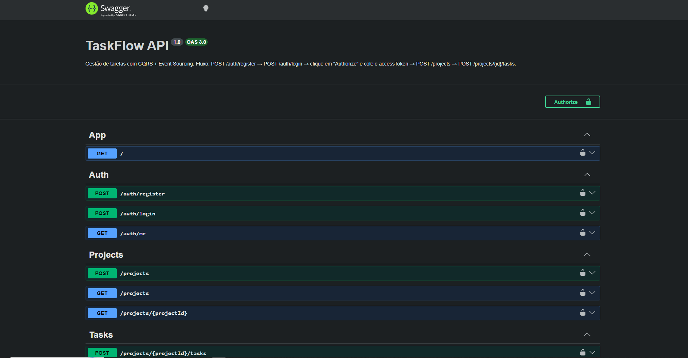

# TaskFlow

[](https://github.com/cassiocidrini/TaskFlow/actions/workflows/ci.yml)


API de gestão de tarefas em **NestJS + TypeScript** com **CQRS + Event Sourcing**: o estado de cada tarefa é
**derivado de eventos imutáveis**, o que dá histórico completo, auditoria e projeções reconstruíveis.

É o projeto prático de uma trilha de estudos de engenharia backend. Cada decisão abaixo tem um arquivo ou um
teste que a comprova; o que **não** está implementado aparece em [Limitações conhecidas](#-limitações-conhecidas).

---

## 🏆 Destaques (com evidência)

| Tema | O que foi feito | Onde ver |
|---|---|---|
| **Event Sourcing de verdade** | Agregado `Task` reconstruído dos eventos, com invariantes (tarefa concluída é imutável) e histórico consultável pela API | [`task.aggregate.ts`](src/modules/tasks/domain/task.aggregate.ts) · `GET …/tasks/:id/history` |
| **Concorrência otimista** | `UNIQUE (aggregate_id, version)` + `expectedVersion`: de 10 escritas simultâneas na mesma versão, **exatamente 1 vence** e as outras recebem `409` | [`event-store.spec.ts`](test/integration/event-store.spec.ts) |
| **Autorização (OWASP A01)** | Toda rota de tarefa exige JWT e posse do projeto; recurso alheio responde `404` (anti-enumeration) e há proteção anti-IDOR em rotas aninhadas | [`tasks.e2e-spec.ts`](test/e2e/tasks.e2e-spec.ts) |
| **Projeções idempotentes** | `INSERT … ON CONFLICT DO NOTHING` e `UPDATE … SET`: entrega duplicada, 5 entregas simultâneas e replay completo resultam no mesmo estado | [`projections.spec.ts`](test/integration/projections.spec.ts) |
| **Health checks e graceful shutdown** | `/health/live` × `/health/ready`; no SIGTERM, readiness 503 e drenagem → HTTP fecha esperando as requisições → banco → telemetria. Sob carga: 0 requisições cortadas | [`health/`](src/health/health.controller.ts) |
| **Mensageria confiável (Kafka)** | Transactional Outbox na mesma transação do Event Store + relay em processo separado (ordem por tarefa, failover entre réplicas, API de pé com o Kafka fora do ar) + consumer **idempotente** (marca e efeito na mesma transação): 300 eventos com `kill -9` no meio = 300 notificações, 0 duplicadas; dois consumer groups no mesmo tópico, com idempotência por tabela de marcas e pela versão do agregado (contador sem *lost update*: a mutação perdeu 17 de 20); replay do Event Store pela outbox (reconstrução do read model: 6 projetos idênticos, 72 fantasmas injetados no tópico eliminados); retry classificado + dead-letter topic com redrive auditado (só o grupo que falhou reprocessa) (Postgres fora 45 s = **0** no DLT; sem a classificação, 6 de 40 eventos legítimos iriam para lá) | [Módulo 13](docs/modules/13-mensageria-kafka.md) · [`notifications.streaming-spec.ts`](test/streaming/notifications.streaming-spec.ts) |
| **Fail-fast de configuração** | Variáveis de ambiente validadas com `zod` no boot: configuração inválida impede a app de subir | [`env.schema.ts`](src/config/env.schema.ts) |
| **Testes com infraestrutura real** | 272 unitários · 71 de integração, 49 E2E e 13 de streaming contra **PostgreSQL e Kafka reais** via Testcontainers | [Testes](#-testes) |
| **Observabilidade** | OpenTelemetry → Jaeger (traces) e Prometheus (métricas com `http_route`, sem os probes); Grafana **provisionado** com dashboard RED + banco + event loop; logs JSON com `correlationId` e `trace_id`; **um trace só** do request ao consumer do Kafka (contexto W3C gravado na outbox); dashboard de mensageria (outbox, lag pelo broker, DLTs) e **9 alertas como código testados com `promtool`** | [`tracing.ts`](src/tracing.ts) · [`grafana/`](grafana/dashboards/taskflow-api.json) |
| **IaC** | Terraform (S3, SQS, SNS, IAM de menor privilégio) com backend remoto, sobre LocalStack | [`terraform/`](terraform/) |

---

## 🏗️ Arquitetura


```mermaid
flowchart LR
    C[Cliente HTTP] -->|JWT| CT[Controller]

    subgraph Escrita [Escrita — Command side]
        CT -->|Command| CH[Command Handler]
        CH --> R[TaskCommandRunner<br/>1. assertOwner<br/>2. load agregado<br/>3. regra de domínio<br/>4. save<br/>5. publish]
        R <-->|fromHistory / appendMany| ES[(Event Store<br/>events)]
        R -->|mesma transação| OB[(outbox)]
    end

    OB -->|relay<br/>processo separado| K[[Kafka<br/>taskflow.task-events.v1]]
    K -->|consumer group<br/>notifications| NO[(notifications)]

    subgraph Leitura [Leitura — Query side]
        CT -->|Query| QH[Query Handler]
        QH --> RM[(Read Model<br/>tasks_read)]
        QH -->|histórico| ES
    end

    R -->|EventBus| P[Projeções<br/>idempotentes]
    P --> RM
```

- **Escrita:** cada comando carrega o agregado a partir dos eventos, valida a regra de negócio e grava os eventos novos com **concorrência otimista**. Um conflito de versão responde `409`.
- **Leitura:** listagens vêm do Read Model `tasks_read`, uma projeção desnormalizada e paginada por cursor. O histórico vem direto do Event Store.
- **Projeções** rodam depois da resposta HTTP (**consistência eventual**) e são idempotentes, o que torna seguro reprocessá-las.
- **Kafka:** cada evento ganha, na mesma transação, um evento de **integração** na `outbox`. Um relay (outro processo) publica no tópico em ordem por tarefa; o consumer group `notifications` (outro processo) gera as notificações, deduplicando por `eventId`. A API nunca fala com o broker ([Módulo 13](docs/modules/13-mensageria-kafka.md)).

### Event Sourcing na prática

`GET /projects/:projectId/tasks/:taskId/history` devolve a linha do tempo completa **e** o estado atual
reconstruído dos próprios eventos:

```json
{
  "current": { "title": "Tarefa do ciclo de vida", "status": "DONE", "version": 4, "...": "..." },
  "history": [
    { "version": 1, "type": "TaskCreated",       "occurredAt": "2026-10-18T05:43:16.244Z" },
    { "version": 2, "type": "TaskAssigned",      "occurredAt": "2026-10-18T05:43:16.278Z" },
    { "version": 3, "type": "TaskStatusChanged", "data": { "from": "PENDING", "to": "IN_PROGRESS" } },
    { "version": 4, "type": "TaskCompleted",     "occurredAt": "2026-10-18T05:43:16.306Z" }
  ]
}
```

**Por que isso importa:** durante o desenvolvimento, um bug fez a projeção gravar `priority = MEDIUM` para uma
tarefa cujo evento dizia `HIGH`. Num CRUD, o valor original estaria perdido. Aqui o histórico continuou
respondendo `HIGH`, porque **os eventos são a fonte da verdade** e a projeção é descartável e reconstruível.

### Padrões de projeto aplicados

| Padrão | Onde |
|---|---|
| **CQRS** | `commands/` × `queries/` em [`modules/tasks`](src/modules/tasks) |
| **Event Sourcing** | [`event-store.service.ts`](src/events/event-store.service.ts) + [`task.aggregate.ts`](src/modules/tasks/domain/task.aggregate.ts) |
| **Repository** | [`task.repository.ts`](src/modules/tasks/domain/task.repository.ts) (contrato) → [`event-sourced-task.repository.ts`](src/modules/tasks/infrastructure/event-sourced-task.repository.ts) |
| **Template Method** (funcional) | [`task-command.runner.ts`](src/modules/tasks/commands/task-command.runner.ts): roteiro fixo, passo variável injetado |
| **Strategy** | [`task-priority.strategy.ts`](src/modules/tasks/strategies/task-priority.strategy.ts): cálculo de prioridade |
| **Observer** | `EventBus` do `@nestjs/cqrs` → projeções |

---

## ⚡ Quickstart (≈ 5 min)

**Pré-requisitos:** Node.js 24+ (há um `.nvmrc`) e Docker (com Compose v2). Os mesmos comandos funcionam em
Linux, macOS e Windows:

```bash
git clone https://github.com/cassiocidrini/TaskFlow.git
cd TaskFlow
npm run setup    # confere Node e Docker, cria o .env, instala, sobe Postgres + Jaeger e aplica as migrações
npm run dev      # garante a infra de pé e inicia a API em modo watch
```

<details>
<summary>O que o <code>npm run setup</code> faz, passo a passo</summary>

```bash
cp .env.example .env                       # só se ainda não existir (nunca sobrescreve)
npm ci
docker compose up -d --wait postgres jaeger  # --wait usa o healthcheck: segue quando o banco aceita conexões
npx prisma generate
npx prisma migrate deploy
```

O script é [`scripts/dev/setup.mjs`](scripts/dev/setup.mjs), escrito só com módulos nativos do Node (roda antes
do `npm ci`) e idempotente: pode ser rodado de novo sem estragar nada.
</details>

Abra **http://localhost:3000/docs**: a documentação interativa (Swagger) é gerada a partir do código.



**Fluxo no Swagger:** `POST /auth/register` → `POST /auth/login` → **Authorize** (cole o `accessToken`) →
`POST /projects` → `POST /projects/{projectId}/tasks`.

<details>
<summary>Prefere o terminal? Fluxo completo com <code>curl</code> (bash)</summary>

```bash
API=http://localhost:3000
curl -s -X POST $API/auth/register -H 'Content-Type: application/json' \
  -d '{"email":"demo@taskflow.dev","name":"Demo","password":"senha12345"}'
TOKEN=$(curl -s -X POST $API/auth/login -H 'Content-Type: application/json' \
  -d '{"email":"demo@taskflow.dev","password":"senha12345"}' | jq -r .accessToken)
AUTH="Authorization: Bearer $TOKEN"

PROJECT=$(curl -s -X POST $API/projects -H "$AUTH" -H 'Content-Type: application/json' \
  -d '{"name":"Meu projeto"}' | jq -r .id)
TASK=$(curl -s -X POST $API/projects/$PROJECT/tasks -H "$AUTH" -H 'Content-Type: application/json' \
  -d '{"title":"Corrigir bug urgente","dueDate":"2026-12-31T23:59:59Z"}' | jq -r .taskId)

curl -s -X PATCH $API/projects/$PROJECT/tasks/$TASK/status -H "$AUTH" -H 'Content-Type: application/json' \
  -d '{"status":"IN_PROGRESS"}'
curl -s -X POST  $API/projects/$PROJECT/tasks/$TASK/complete -H "$AUTH"
curl -s $API/projects/$PROJECT/tasks/$TASK/history -H "$AUTH" | jq
```
</details>

### Serviços locais (`docker compose up -d`)

| Serviço | URL | Credenciais |
|---|---|---|
| API + Swagger | http://localhost:3000/docs | — |
| Jaeger (traces) | http://localhost:16686 | — |
| Métricas (exporter OTel) | http://localhost:9464/metrics (API) · :9465 (relay) · :9467 (consumer de notificações) | — |
| Prometheus | http://localhost:9090 | — |
| Grafana | http://localhost:3001 | `admin` / `admin` · dashboard **TaskFlow API** já provisionado |
| LocalStack (AWS) | http://localhost:4566 | `test` / `test` |

### Comandos do dia a dia

| Comando | O que faz |
|---|---|
| `npm run dev` | Sobe Postgres + Jaeger (se preciso) e inicia a API em modo watch |
| `npm run infra:up:obs` | Postgres + Jaeger + Prometheus + Grafana |
| `npm run infra:down` | Derruba os containers (os dados ficam nos volumes) |
| `npm run aws:up` · `aws:down` · `aws:recreate` | LocalStack + Terraform ([Módulo 09](docs/modules/09-infraestrutura-como-codigo.md)) |
| `npm run aws:resources` | Lista as filas SQS e os buckets S3 criados |
| `npm run streaming:up` · `streaming:down` · `streaming:topics` | Kafka 4 (KRaft) e criação dos tópicos ([Módulo 13](docs/modules/13-mensageria-kafka.md)); fora do `npm run dev` |
| `npm run kafka:smoke` | Produz e consome uma mensagem de teste (valida cliente e broker) |
| `npm run relay:dev` · `start:relay` | Relay da outbox → Kafka, processo separado da API (precisa do `streaming:up`) |
| `npm run consumer:notifications:dev` · `start:consumer:notifications` | Consumer group `notifications` (Kafka → notificações), outro processo |

---

## 📡 API

Todas as rotas, exceto `register` e `login`, exigem `Authorization: Bearer <token>`. Toda resposta traz
`X-Correlation-Id`: o valor enviado pelo cliente (até 64 caracteres `[A-Za-z0-9._-]`) ou um UUID gerado pela API.

| Método | Rota | Descrição |
|---|---|---|
| `POST` | `/auth/register` · `/auth/login` | Cadastro e login (JWT) |
| `GET` | `/auth/me` | Usuário autenticado |
| `POST` · `GET` | `/projects` | Criar / listar **meus** projetos |
| `GET` | `/projects/:projectId` | Detalhe do projeto (404 se não for meu) |
| `GET` | `/projects/:projectId/stats` | Números do projeto (por status, sem responsável, lead time médio) calculados pelo consumer `reports`; `asOf` = até quando |
| `POST` | `/projects/:projectId/tasks` | Criar tarefa (prioridade calculada automaticamente) |
| `GET` | `/projects/:projectId/tasks?limit=&cursor=` | Listar tarefas, paginação por cursor (máx. 100) |
| `PATCH` | `/projects/:projectId/tasks/:taskId/assignee` | Atribuir responsável |
| `PATCH` | `/projects/:projectId/tasks/:taskId/status` | `PENDING` ⇄ `IN_PROGRESS` |
| `POST` | `/projects/:projectId/tasks/:taskId/complete` | Concluir (terminal: depois disso, `409`) |
| `GET` | `/projects/:projectId/tasks/:taskId/history` | Linha do tempo de eventos + estado reconstruído |
| `GET` | `/me/notifications?limit=&cursor=` | **Minhas** notificações (atribuição e conclusão), geradas pelo consumer do Kafka |

**Códigos de resposta relevantes:** `400` entrada inválida · `401` sem token · `404` recurso inexistente **ou
de outro usuário** · `409` regra de negócio violada ou conflito de concorrência · `429` rate limit.

---

## 🧪 Testes

| Suíte | Qtd. | Infraestrutura | O que prova |
|---|---:|---|---|
| **Unitários** | 272 | Nenhuma (mocks) | Regras do agregado (sem mocks), handlers, autorização, ordem `save → publish`, contrato de integração, loop e backoff do relay, spans `create`/`publish` do relay, regras de notificação e leitor tolerante, deltas dos relatórios |
| **Integração** | 71 | PostgreSQL real e `promtool` (Testcontainers) | Concorrência otimista, atomicidade de `events` + `outbox`, envelope de metadados, idempotência das projeções e do consumer, ordem do graceful shutdown, lock do relay com duas réplicas, contexto de trace gravado na outbox, guarda de versão e contadores sem *lost update* nos relatórios, regras de alerta disparando quando devem |
| **E2E** | 49 | HTTP + PostgreSQL real | 401/400/404/409, anti-IDOR, ciclo de vida, histórico com autor, paginação, consistência eventual, `X-Correlation-Id`, health checks, API → outbox, `/me/notifications` só do próprio usuário, stats do projeto só para o dono |
| **Streaming** | 13 | Kafka + PostgreSQL reais | Outbox → relay → tópico → consumer: chave, partição, ordem, headers; republicação sem notificação extra; restart sem reprocessar; falha com backoff sem furar a ordem; **um trace só** do request ao consumer; poison pill no DLT sem parar a partição; banco fora sem nada no DLT; DLT fora sem perder a mensagem; dois consumer groups no mesmo tópico sem dobrar números na republicação |

```bash
npm run test:unit          # ~3 s — use o tempo todo
npm run test:integration   # Docker necessário
npm run test:e2e           # Docker necessário
npm run test:streaming     # Docker necessário (sobe Kafka)
npm test                   # unit, integration e e2e, em sequência
npx tsc --noEmit && npm run lint
```

> As suítes com Testcontainers rodam em fila (`--runInBand`): várias instâncias de PostgreSQL em paralelo
> esgotam a memória de máquinas de desenvolvimento modestas.

### CI

Cada PR para a `main` dispara [4 jobs paralelos](.github/workflows/ci.yml), e todos são obrigatórios para o merge:
**tipos + lint + unitários + build** · **integração** · **E2E** · **streaming** (Kafka real). O workflow roda com `permissions: contents: read`
e cancela execuções obsoletas do mesmo PR.

---

## 🧭 Decisões de design

| Decisão | Alternativa descartada | Por quê |
|---|---|---|
| PostgreSQL como Event Store | EventStoreDB, Kafka | Um banco só para operar; `UNIQUE` + transações atômicas bastam para a escala do projeto |
| Concorrência otimista (`expectedVersion`) | Locks pessimistas | Sem bloqueio na leitura; o conflito é raro e detectado atomicamente pelo banco |
| `404` para recurso de outro usuário | `403` | `403` confirmaria que o recurso existe (enumeration); mesmo padrão de GitHub e S3 |
| Paginação por cursor | Offset (`?page=`) | Estável sob inserções concorrentes e sem degradar em páginas profundas |
| Projetos como CRUD simples | Event Sourcing em tudo | Projeto não tem histórico relevante; ES onde agrega valor, não por padrão |
| Agregado sem dependências de framework | Regras nos handlers | Regras num único lugar, testáveis em milissegundos sem mocks |

---

## 🚧 Limitações conhecidas

Escolhas conscientes de escopo, com o próximo passo de cada uma:

- **Dual-write entre Event Store e EventBus (projeções internas):** se o processo cair entre gravar e publicar, a projeção não é atualizada. A *Transactional Outbox* já existe (Módulo 13.2), mas cobre o caminho do Kafka; as projeções continuam no `EventBus` em memória. O `reports` já é uma projeção alimentada pelo tópico e reconstruível por `npm run replay` (Módulo 13.6b); próximo passo: levar o `tasks_read` para o mesmo modelo.
- **EventBus em memória:** entrega em ordem dentro de um processo. Os eventos já chegam ao Kafka pela outbox + relay (Módulo 13) e o consumer de notificações os lê, mas as **projeções internas** (`tasks_read`) continuam no `EventBus`. Com consumers externos, as projeções precisarão guardar a versão do agregado para descartar eventos fora de ordem.
- **Relay da outbox:** um lote por vez (ordem acima de vazão); uma mensagem com erro permanente trava a fila. Sem DLQ no relay **por decisão** (as falhas possíveis ali são de infraestrutura e atingiriam todas as mensagens), com runbook para estacionar a linha à mão (Módulo 13.5).
- **Consumer de notificações:** o redrive do DLT é manual e por grupo inteiro (`npm run redrive`, com `--dry-run` e auditoria) e, ao desviar uma mensagem, as seguintes da mesma tarefa passam sem ela (ordem trocada por disponibilidade); API e consumer dividem o Postgres (fronteira por convenção); um crash (`kill -9`) pausa as partições por 30 s (session timeout).
- **Consumer de relatórios:** tarefas criadas antes da outbox só entram nos números com um replay; reconstruir a projeção exige parar o consumer até o lag zerar; `project_stats` é uma linha quente por projeto.
- **Replay:** republica o histórico inteiro (sem filtro por período ou projeto), e o lock por agregado que garante a ordem custa uma instrução por gravação da API.
- **Logs:** JSON no stdout com `correlationId` e `trace_id`, mas sem agregador local (Loki).
- **Alertas sem roteamento:** 9 regras de alerta testadas no CI disparam no Prometheus, mas sem Alertmanager ninguém é avisado fora dele; os limiares são pontos de partida, não derivados de SLO.
- **Eventos antigos sem autor:** eventos gravados antes do envelope de metadados aparecem no histórico com `actorId: null`; o autor não é inferido. O metadata ainda não chega ao `EventBus` nem às projeções.
- **Dockerfile:** usa `node:20` (o projeto exige 24), não roda como usuário não-root e não declara `HEALTHCHECK` (os probes `/health` existem, mas nenhum orquestrador os consome ainda).
- **Rate limit em memória:** não é compartilhado entre réplicas (em produção, usaria Redis).
- **Terraform sem lock do state:** o backend S3 não tem `use_lockfile`; dois `apply` simultâneos poderiam corromper o state.
- **Strategy de prioridade incompleto:** a estratégia é instanciada no handler (não injetada) e a `DeadlinePriorityStrategy` não é usada.

---

## 📁 Estrutura

```text
src/
├── config/                 # env.schema.ts — validação do ambiente (zod)
├── common/
│   ├── dto/                # paginação por cursor
│   ├── correlation/        # X-Correlation-Id + AsyncLocalStorage
│   ├── lifecycle/          # encerramento do OpenTelemetry no graceful shutdown
│   ├── telemetry/          # http.route nas métricas e spans (RouteTelemetryGuard)
│   └── logging/            # opções do nestjs-pino (logs JSON)
├── events/                 # EventStoreService (append atômico, concorrência otimista, outbox na mesma transação)
├── outbox-relay/           # relay da outbox → Kafka (processo separado: relay.ts)
├── replay/                 # replay do Event Store pela outbox (comando: replay.ts)
├── redrive/                # redrive do DLT com política por grupo e auditoria (comando: redrive.ts)
├── health/                 # /health/live, /health/ready, drenagem do graceful shutdown
├── modules/
│   ├── auth/               # JWT + bcrypt, guards, @CurrentUser
│   ├── projects/           # CRUD de projetos + assertOwner (autorização)
│   ├── notifications/      # GET /me/notifications + consumer/ (processo separado: notifications-consumer.ts)
│   ├── reports/            # GET /projects/:id/stats + consumer/ (processo separado: reports-consumer.ts)
│   └── tasks/
│       ├── domain/         # TaskAggregate + contrato TaskRepository (sem framework)
│       ├── infrastructure/ # EventSourcedTaskRepository
│       ├── commands/       # comandos + TaskCommandRunner
│       ├── queries/        # listagem (Read Model) e histórico (Event Store)
│       ├── events/         # eventos de domínio + projeções
│       └── strategies/     # Strategy de prioridade
├── app.setup.ts            # Helmet, CORS, ValidationPipe, Swagger (compartilhado com o E2E)
├── tracing.ts              # OpenTelemetry da API (carregado antes do Nest)
├── relay-tracing.ts        # OpenTelemetry do relay
├── relay.ts                # entrypoint do relay (Nest sem HTTP)
├── replay.ts               # comando npm run replay (republica o Event Store pela outbox)
├── redrive.ts              # comando npm run redrive (DLT → tópico de origem, só para o grupo que falhou)
├── notifications-consumer.ts # entrypoint do consumer group notifications
├── reports-consumer.ts     # entrypoint do consumer group reports
└── main.ts                 # entrypoint da API
test/                       # unit/ · integration/ · e2e/ · streaming/ — a pirâmide de testes (Jest)
terraform/                  # IaC (S3, SQS, SNS, IAM)
grafana/                    # datasources e dashboard provisionados (dashboard como código)

# Fora do produto: não entram no build nem na imagem de produção
scripts/                    # ferramentas de dev: list-events.ts, dynamo/ (lab do Módulo 4), kafka/smoke.ts (Módulo 13)
load/                       # testes de carga da API: k6/ e autocannon/ (Módulo 10)
labs/node-internals/        # experimentos do runtime: event loop, streams, leaks (Módulo 11)
```

`src/` contém só o produto: a API, o relay da outbox e o consumer de notificações (três processos, mesma imagem). O que é estudo ou ferramenta fica fora dele, para não ser compilado no `dist/` nem
confundido com código de produção.

---

## 📚 Trilha de estudos

Este repositório é o laboratório de uma trilha de engenharia backend. Cada módulo documenta conceitos, como
reproduzir, **problemas reais encontrados** e onde o resultado vive no código. Índice completo em
[`docs/modules/`](docs/modules/README.md).

| Módulo | Tema | No projeto |
|:-:|---|---|
| [01](docs/modules/01-observabilidade.md) | Observabilidade (OpenTelemetry, Jaeger, Prometheus, Grafana) | `tracing.ts`, `common/logging/`, `common/correlation/`, `docker-compose.yml` |
| 02 | Orquestração com Kubernetes | 🔜 planejado para um ambiente Linux dedicado |
| [03](docs/modules/03-ci-cd-github-actions.md) | CI/CD com GitHub Actions | `.github/workflows/ci.yml` |
| [04](docs/modules/04-modelagem-nosql-dynamodb.md) | Modelagem NoSQL (DynamoDB, single-table, GSI) | `scripts/dynamo/` |
| [05](docs/modules/05-event-sourcing-cqrs.md) | Event Sourcing, CQRS e arquitetura | `src/modules/tasks/`, `src/events/` |
| [06](docs/modules/06-seguranca-owasp.md) | Segurança (OWASP Top 10) | `auth/`, `app.setup.ts`, autorização por projeto |
| [07](docs/modules/07-testes.md) | Testes (unitários, integração, E2E) | `test/` |
| [08](docs/modules/08-ia-no-desenvolvimento.md) | Engenharia assistida por IA | [`AGENTS.md`](AGENTS.md) |
| [09](docs/modules/09-infraestrutura-como-codigo.md) | Infraestrutura como Código (Terraform) | `terraform/` |
| [10](docs/modules/10-performance-load-testing.md) | Performance e load testing (k6) | `load/` |
| [11](docs/modules/11-nodejs-internals.md) | Node.js internals (event loop, thread pool, streams, leaks) | `labs/node-internals/` |
| [12](docs/modules/12-design-patterns.md) | Design patterns | ver [Padrões de projeto aplicados](#padrões-de-projeto-aplicados) |
| [13](docs/modules/13-mensageria-kafka.md) | Mensageria e streaming com Kafka (🚧 13.6d de 13.8) | `docker-compose.yml` (profile `streaming`), `events/`, `outbox-relay/`, `modules/notifications/consumer/`, `common/messaging/` |

---

## 📝 Licença

Projeto de estudo e portfólio. Todos os direitos reservados (`UNLICENSED`).
